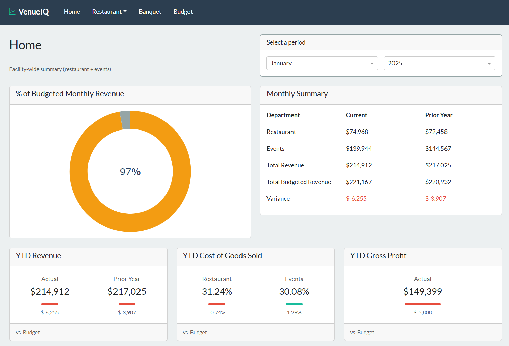
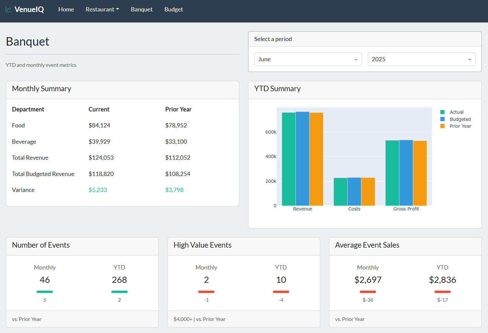
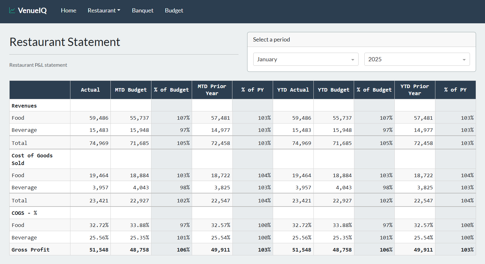

# VenueIQ

A full-stack Dash application for hospitality analytics that transforms operational and financial data into actionable insights through interactive dashboards.


<br>**Live Demo:**
<br>
*The demo uses seeded sample data to simulate real-world operations.*

<br>

## <br>Problem

Hospitality operators often rely on spreadsheets, manual data entry, or disconnected reports to evaluate performance across departments. This makes it difficult to quickly identify trends, cost issues, or underperforming areas.

VenueIQ centralizes these metrics into a single dashboard designed around how hospitality managers actually evaluate performance.

## <br>Key Features

- Dashboards organized by operational area (Restaurant and Banquet)
- P&L-style financial summaries and KPI breakdowns
- Menu item performance and sales mix analysis
- Year-to-date and period-based views

## <br>Technical Highlights
- Modular, multi-page Dash architecture with dedicated services and callbacks
- MongoDB data modeling using aggregation pipelines for efficient reporting
- Reusable metric builders for dynamic KPI visualizations
- Full-stack development with clear back-end data handling and front-end integration
- Responsive layout with Bootstrap for desktop and mobile compatibility
- Environment-based configuration with structured error handling and logging

## <br>Tech Stack

- **Frontend:** Python Dash, Dash Bootstrap Components, Plotly
- **Backend:** Python, MongoEngine (ODM), pandas
- **Database:** MongoDB Atlas
- **Deployment:** Render (with Gunicorn)

## <br>Project Structure

```text
src/
├── app.py
├── callbacks/
├── components/
├── metrics/
├── models/
├── pages/
├── partials/
├── services/
└── utils/
```

## <br>Architecture & Design

- Refactored from a monolithic structure into a **scalable, modular architecture** with clear separation between models, services, metrics, callbacks, and layouts
- Database access and calculations are handled in service and metrics layers to keep Dash callbacks **lightweight and maintainable**
- Aggregations and filtering are performed at the **database level (MongoDB)** to reduce data transfer and repeated client-side computation
- Feature development was done on isolated branches and merged into `main` using **Pull Requests**, ensuring a clean and auditable release history

## <br>Screenshots
### Banquet Dashboard ###


### <br>Restaurant Statement ###


## <br>Future Enhancements ##
- User authentication and role-based access for department-specific data viewing
- Integrate automatic data retrieval from real-world operational systems
- Optimize performance for larger datasets and additional venue locations
- Develop an exportable report generator for presentations and decision-making
- Introduce a modular framework to add and customize new operational departments and KPIs easily

## <br>Author
- **Jake Clara**
- [Github](https://github.com/jakeclara)
